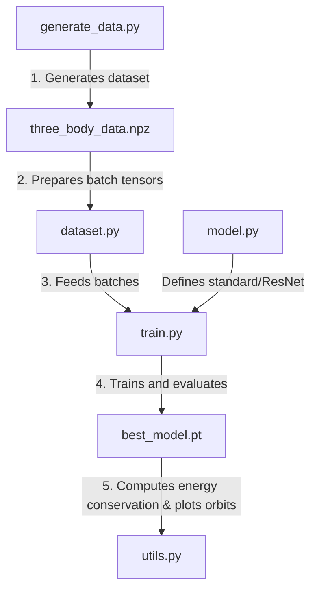

# How the Physics-Informed Neural Network (PINN) Works

## 🌌 The Core Problem: The Three-Body Problem

Imagine three stars floating in space. Each star pulls on the other two stars due to gravity. The question is: **Given their starting positions, can we predict their future paths (orbits)?**

While we can easily solve this for two bodies (like the Earth and the Sun) using a simple formula, **three bodies are chaotic**. This means:
1. There is no neat, closed-form mathematical formula to describe their paths.
2. Even a tiny, microscopic change in their starting positions can lead to completely different paths over time.
3. Traditional methods rely on "numerical simulators" that compute the paths step-by-step. However, these simulators are computationally expensive and get slower as you simulate more steps.

---

## 🧠 What is a Physics-Informed Neural Network (PINN)?

To speed this up, we can train a **Neural Network** (a type of AI model) to learn the patterns of these orbits. 

### The Problem with Standard AI
A standard AI model only looks at a list of simulated positions and velocities and tries to copy them ("connecting the dots"). It has no idea what gravity is, what energy is, or what Newton's laws are. Consequently:
- It might predict that two stars pass directly through each other.
- It might predict that a star suddenly gains speed (creating energy out of thin air).
- It struggles to make realistic predictions on starting positions it hasn't seen before.

### The PINN Solution
A Physics-Informed Neural Network (PINN) fixes this by adding **Newton's Laws of Motion** directly into the AI's learning process. 

When the AI is training, we calculate a score of how well it's doing (called the **Loss**). For a PINN, this score has two parts:
1. **Data Loss (MAE)**: How close is the AI's prediction to the actual numbers in our dataset?
2. **Physics Loss (MSE)**: Does the AI's predicted path obey physics?
   - Newton's first law says velocity is the derivative of position ($v = \dot{r}$). We check if the predicted velocities match the change in predicted positions.
   - Newton's second law says force equals mass times acceleration ($F = ma$, or $a = - \sum \frac{r_i - r_j}{\|r_i - r_j\|^3}$). We check if the predicted accelerations match the actual gravitational pull of the predicted positions.

If the AI predicts a path that violates these equations, the **Physics Loss** goes up, and the AI is forced to adjust its weights. This acts as a physical "boundary" or "guide rails" for the AI, keeping its predictions physically realistic.

---

## 🏛️ Network Architecture: standard vs. ResNet

Our code implements two options:

### 1. Standard Feed-Forward Network (`StandardDNN`)
This is a standard network where inputs pass through 12 successive layers. Each layer performs a linear transformation followed by a non-linear activation (`ReLU`).

### 2. Residual Network (`ResNetDNN`)
As we add physics equations, the network's mathematical landscape becomes extremely complex, making training volatile (the "exploding gradients" problem).
To solve this, we implement **skip connections** (residual blocks) as shown in the diagram below:

```
          +-------------------------------+ (Skip Connection)
          |                               |
          v                               |
Input ---> [Linear -> ReLU -> Linear] ---> [+] ---> [ReLU] ---> Output
```

Instead of forcing the network to learn the entire trajectory from scratch, each residual block only learns the *difference* (residual) from the previous layer. This allows gradients to flow smoothly during training and stabilizes the learning process.

---

## 📂 What We Have Implemented

Here is how the files we wrote fit together:



1. **[generate_data.py](file:///home/kvothe/projects/three-body-simulator/model_training/pinn/generate_data.py)**: The creator of training data. It randomly places the second body, integrates the orbit using high-precision solvers, filters out collisions, and outputs the training data.
2. **[model.py](file:///home/kvothe/projects/three-body-simulator/model_training/pinn/model.py)**: The neural network architectures (Standard and ResNet).
3. **[dataset.py](file:///home/kvothe/projects/three-body-simulator/model_training/pinn/dataset.py)**: An optimized loading script that reads the NPZ files and formats them into tensors instantly using vectorized matrix transformations.
4. **[train.py](file:///home/kvothe/projects/three-body-simulator/model_training/pinn/train.py)**: The training pipeline. It computes the coordinate derivatives w.r.t time using PyTorch's `autograd`, updates model weights, and manages the learning rates.
5. **[utils.py](file:///home/kvothe/projects/three-body-simulator/model_training/pinn/utils.py)**: The validator. It loads the best checkpoint, runs predictions, calculates whether kinetic + potential energy is constant, and creates comparison charts.
